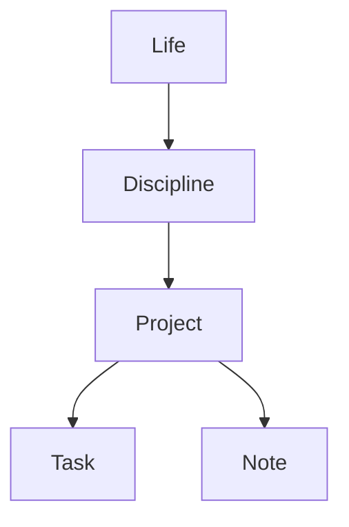

# Northstar Usage

This is the practical first-use flow for the personal OS.

## Mental Model

Use the Life -> Disciplines -> Projects spine:

- Discipline: a durable area of growth or responsibility.
- Project: a concrete multi-step outcome inside a discipline.
- Task: a next action that can be done and marked complete.
- Calendar event: reserved time.
- Note: durable knowledge, context, learning, or rationale.

## What To Create First

Create a discipline first when the area will last more than a few days.

Reason: a discipline gives later projects and tasks their direction. Without a
discipline, the system becomes another flat todo list.

Examples:

- `IELTS`
- `HSK`
- `Scholarships`
- `Career`
- `Health`
- `Finance`

Then create projects under that discipline.

Examples:

- Discipline `IELTS` -> project `IELTS Band 7.0`
- Discipline `Scholarships` -> project `Chevening 2027`
- Discipline `Career` -> project `Northstar MVP`

Skip a project for one-off work. A single reminder can be just a task.

Use this rule of thumb:

- Durable area -> discipline.
- Multi-step outcome -> project.
- Concrete next action -> task.
- Reserved time -> calendar event.
- Durable context -> note.

## Daily Flow

1. Check today's tasks and upcoming events.
2. Pick one project or discipline focus.
3. Create/complete tasks for concrete next actions.
4. Put real time blocks on the calendar when needed.
5. Capture notes when something should be remembered.
6. At the end of the day or week, draft a review.

## Agent/MCP Flow

When using Northstar through an agent:

- Search before creating a note to avoid duplicates.
- Prefer appending to an existing note when the topic already exists.
- Normalize dates to `yyyy-MM-dd`.
- Normalize times to `HH:mm`.
- Do not delete tasks/events/projects unless the user clearly asks.

### Note Authoring

Agents can create and edit notes directly through MCP because note bodies are
plain Markdown. Treat Markdown as the source of truth for note content.

- Search first; create a new note only when the topic does not already exist.
- Prefer `append_to_note` for additive context and `update_note` only when the
  whole note should be rewritten or moved.
- Attach `projectId` when a note belongs to one project. Keep project
  descriptions short and put durable detail in the note.
- Use `[[Exact Note Title]]` wiki links only when the relationship is real.
- Use one to four lowercase tags.
- Avoid duplicating the title as the first `# Heading` unless the Markdown needs
  to be export-ready.
- Prefer Mermaid for process flows, lifecycle maps, architecture diagrams,
  dependency graphs, and decision flows. Use bullets only when the structure is
  simpler than a diagram.

Example:

## First Setup Checklist

Create a small initial structure:

1. Discipline: `Northstar`
2. Project: `Northstar MVP`
3. Task: `Review Today dashboard direction`
4. Calendar event: one focused planning block
5. Note: `Northstar operating principles`

After that, add real life areas one by one instead of modeling everything up
front.
